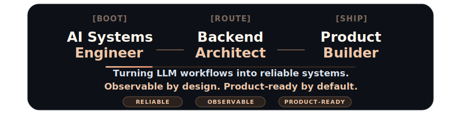

<h1 align="center"><code>Sharveesh M</code></h1>

  

  

  
  
  
  

  

  

<strong>01 · Languages</strong>

<strong>02 · AI, Backend, Frontend</strong>

<strong>03 · Tools & Infrastructure</strong>

  

<strong>Runtime Focus</strong>

HELIOS turns open-ended goals into observable agent workflows with planning, retrieval, memory, tool execution, and evaluation built into the loop.

- Plans task graphs from open-ended goals
- Retrieves grounded context for each step
- Preserves durable state across long-running work
- Routes tools and APIs through observable execution
- Evaluates results and retries failed paths

  

| Layer | Handles | Produces |
| --- | --- | --- |
| <strong><code>Planning</code></strong> | Goal decomposition | <strong>Ordered task graph</strong> |
| <strong><code>Retrieval</code></strong> | Semantic grounding | <strong>Relevant evidence</strong> |
| <strong><code>Memory</code></strong> | Persistent state | <strong>Durable context</strong> |
| <strong><code>Execution</code></strong> | Tool and API routing | <strong>Completed actions</strong> |
| <strong><code>Evaluation</code></strong> | Validation and retries | <strong>Verified outcomes</strong> |

`LangGraph` · `Gemini` · `Ollama` · `FAISS` · `FastAPI` · `WebSockets`

  

  

  
  
  
  

  

<table>
  <tr>
    <td width="50%" valign="top">
      
        
      <strong>June 2026 - Present</strong>
       
      <strong><code>FOCUS</code></strong>
       
      &rsaquo; <strong>LLM-powered systems</strong>
       
      &rsaquo; <strong>Autonomous workflows</strong>
       
      &rsaquo; <strong>Production AI features</strong>
    </td>
    <td width="50%" valign="top">
      
        
      <strong>May 2026 - Present</strong>
       
      <strong><code>FOCUS</code></strong>
       
      &rsaquo; <strong>Scalable mobile experiences</strong>
       
      &rsaquo; <strong>Clean architecture</strong>
       
      &rsaquo; <strong>Performance-focused UI</strong>
    </td>
  </tr>
</table>

  

<table>
  <tr>
    <td width="33%" valign="top">
      
        
      <strong><code>WHAT</code></strong>
       
      Multi-agent AI operating system with planning, retrieval, memory, execution, and evaluation loops.
        
      <strong><code>STACK</code></strong>
       
      <code>Python</code> <code>FastAPI</code> <code>LangGraph</code> <code>FAISS</code>
        
      <strong><code>IMPACT</code></strong>
       
      Turns open-ended tasks into observable, retryable, stateful workflows.
    </td>
    <td width="33%" valign="top">
      
        
      <strong><code>WHAT</code></strong>
       
      Event-driven fintech ledger with transaction intelligence and anomaly detection.
        
      <strong><code>STACK</code></strong>
       
      <code>Spring Boot</code> <code>Kafka</code> <code>PostgreSQL</code> <code>Flutter</code>
        
      <strong><code>IMPACT</code></strong>
       
      Decouples transaction workloads while preserving reliable balance state.
    </td>
    <td width="33%" valign="top">
      
        
      <strong><code>WHAT</code></strong>
       
      Cross-platform commerce platform with seller tooling and reusable mobile UI architecture.
        
      <strong><code>STACK</code></strong>
       
      <code>Flutter</code> <code>Firebase</code> <code>Dart</code> <code>Riverpod</code>
        
      <strong><code>IMPACT</code></strong>
       
      Keeps marketplace features modular and usable under unreliable network conditions.
    </td>
  </tr>
</table>

  

  
   
  
   
  

