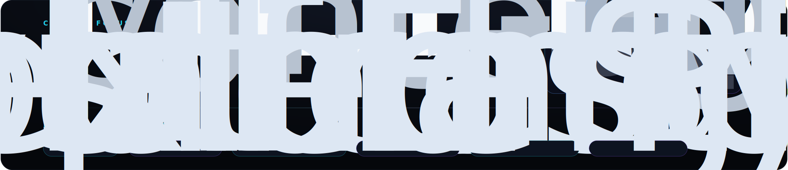
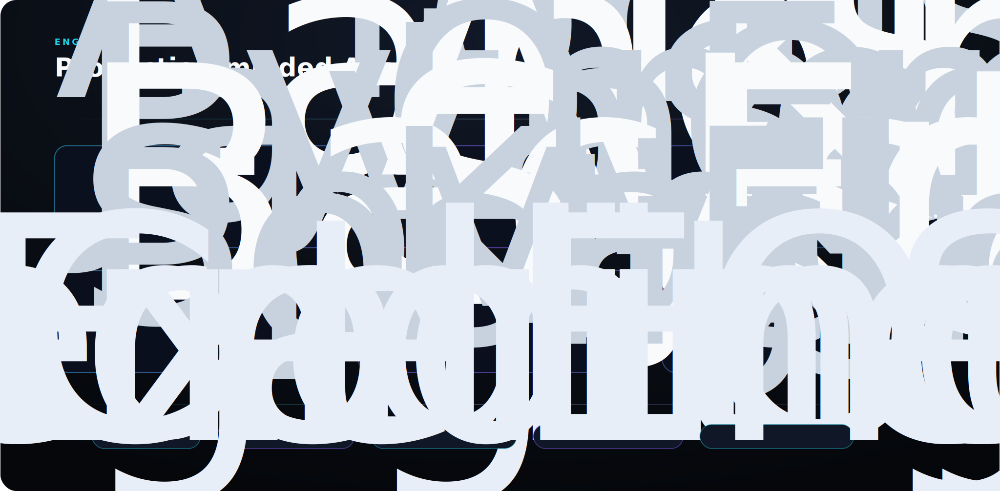

 

  

  

  

  

  

  <a href="https://github.com/SharveeshM1">GitHub</a>
  &nbsp;/&nbsp;
  <a href="https://www.linkedin.com/in/sharveesh-m-52516a283/">LinkedIn</a>
  &nbsp;/&nbsp;
  <a href="mailto:sharveesh1@gmail.com">Email</a>

