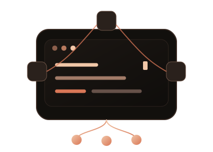
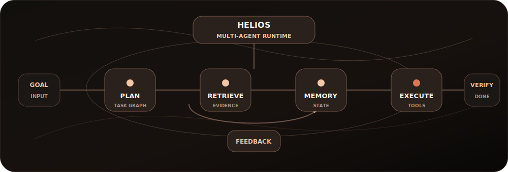

<h1 align="center"><code>Hi, I'm Sharveesh M</code></h1>

<h3 align="center">AI Systems Engineer · Backend Infrastructure · Product Architect</h3>

Building intelligent systems where planning, retrieval, execution, and product experience converge.

  

  
  
  
  

  

## Tech Stack

**Languages**

**AI, Backend, Frontend**

**Tools & Infrastructure**

## HELIOS

**Multi-Agent AI Operating System**

Autonomous task execution platform with distributed agent orchestration, multi-provider LLM inference, persistent vector memory, real-time WebSocket communication, planning, retrieval, routing, and evaluation loops.

  

| Module | Responsibility |
| --- | --- |
| Planning | Decomposes goals into executable task graphs |
| Memory | Preserves state, context, and long-running task knowledge |
| Retrieval | Grounds work through document indexing and semantic search |
| Execution | Routes tools, APIs, and workflow actions |
| Evaluation | Validates outputs and retries failed steps |

`LangGraph` · `Gemini` · `Ollama` · `FAISS` · `FastAPI` · `WebSockets`

## GitHub Activity

  

  
  
  
  

## Experience

<table>
  <tr>
    <td width="50%" valign="top">
      
        
      <strong>June 2026 - Present</strong>
       
      Building LLM-powered systems, autonomous workflows, and production AI features.
    </td>
    <td width="50%" valign="top">
      
        
      <strong>May 2026 - Present</strong>
       
      Developing scalable mobile product experiences with clean architecture and performance focus.
    </td>
  </tr>
</table>

## Flagship Systems

<table>
  <tr>
    <td width="33%" valign="top">
      
        
      Multi-agent AI operating system with planning, retrieval, memory, execution, and evaluation loops.
        
      <code>Python</code> <code>FastAPI</code> <code>LangGraph</code> <code>FAISS</code>
        
      Turns open-ended tasks into observable, retryable, stateful workflows.
    </td>
    <td width="33%" valign="top">
      
        
      Event-driven fintech ledger with transaction intelligence and anomaly detection.
        
      <code>Spring Boot</code> <code>Kafka</code> <code>PostgreSQL</code> <code>Flutter</code>
        
      Decouples transaction workloads while preserving reliable balance state.
    </td>
    <td width="33%" valign="top">
      
        
      Cross-platform commerce platform with seller tooling and reusable mobile UI architecture.
        
      <code>Flutter</code> <code>Firebase</code> <code>Dart</code> <code>Riverpod</code>
        
      Keeps marketplace features modular and usable under unreliable network conditions.
    </td>
  </tr>
</table>

## Current Direction

  
   
  
   
  

