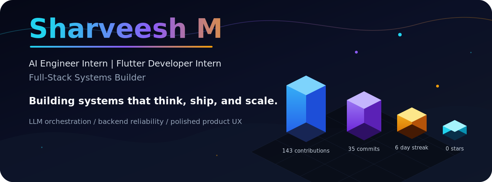
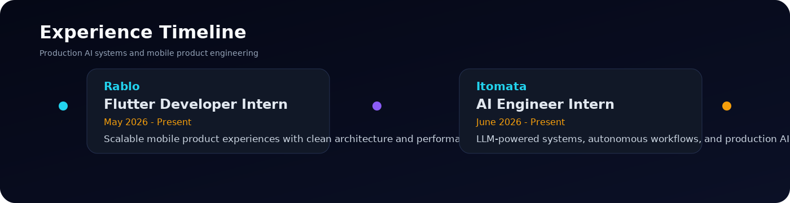

<picture>
  <source media="(prefers-color-scheme: dark)" srcset="./banner.svg">
  <source media="(prefers-color-scheme: light)" srcset="./banner.svg">
  
</picture>

 

 

## About

Computer Science undergraduate building end-to-end AI and backend systems, from multi-agent orchestration and retrieval pipelines to event-driven services and mobile clients. I am comfortable reasoning about state, concurrency, and failure modes, with a focus on systems that stay reliable and maintainable as they grow.

## Education

**VIT-AP University** — B.Tech, Computer Science Engineering — Expected Graduation: **May 2027**

## Current Focus

- Engineering AI systems that plan, retrieve, act, and evaluate under real product constraints.
- Designing mobile and web interfaces that turn complex workflows into clean user journeys.
- Deepening production depth across LLM applications, backend reliability, and cloud deployment.
- Open to AI/ML, backend, and full-stack product engineering roles.

## What I Build

| Track | Systems |
| --- | --- |
| **AI systems** | LLM applications, agentic workflows, RAG pipelines, prompt engineering, task planning, evaluation loops |
| **Backend infrastructure** | FastAPI services, Spring Boot APIs, PostgreSQL persistence, Kafka event flows, secure REST systems |
| **Product surfaces** | Flutter apps, Next.js interfaces, real-time WebSocket UX, reusable UI architecture |
| **DevOps & delivery** | Dockerized services, GitHub Actions, Linux environments, release-ready production builds |

## Skills

**AI / ML**

 

**Backend**

 

**Frontend / Mobile**

 

**Languages**

**Tooling**

 

## Certifications

| Credential | Area |
| --- | --- |
| Oracle AI Foundations Associate | Generative AI |
| Qualcomm AI Foundations | Neural Networks |
| JPMorgan Chase | Software Engineering |
| Vista Equity | AI in Action |
| Kaggle | Intro to Machine Learning |

## Live Stats Dashboard

<table>
  <tr>
    <td width="50%">
      <picture>
        <source media="(prefers-color-scheme: dark)" srcset="https://github-readme-stats.vercel.app/api?username=SharveeshM1&show_icons=true&hide_border=true&rank_icon=github&theme=tokyonight&title_color=22D3EE&icon_color=F59E0B&text_color=CBD5E1&bg_color=0B1026">
        <source media="(prefers-color-scheme: light)" srcset="https://github-readme-stats.vercel.app/api?username=SharveeshM1&show_icons=true&hide_border=true&rank_icon=github&theme=tokyonight&title_color=22D3EE&icon_color=F59E0B&text_color=CBD5E1&bg_color=0B1026">
        
      </picture>
    </td>
    <td width="50%">
      <picture>
        <source media="(prefers-color-scheme: dark)" srcset="https://streak-stats.demolab.com?user=SharveeshM1&theme=tokyonight&hide_border=true&background=0B1026&ring=22D3EE&fire=F59E0B&currStreakLabel=22D3EE&sideLabels=CBD5E1&dates=94A3B8">
        <source media="(prefers-color-scheme: light)" srcset="https://streak-stats.demolab.com?user=SharveeshM1&theme=tokyonight&hide_border=true&background=0B1026&ring=22D3EE&fire=F59E0B&currStreakLabel=22D3EE&sideLabels=CBD5E1&dates=94A3B8">
        
      </picture>
    </td>
  </tr>
  <tr>
    <td colspan="2">
      <picture>
        <source media="(prefers-color-scheme: dark)" srcset="https://github-profile-trophy.vercel.app/?username=SharveeshM1&theme=tokyonight&no-frame=true&no-bg=true&margin-w=8&margin-h=8&column=6&row=1">
        <source media="(prefers-color-scheme: light)" srcset="https://github-profile-trophy.vercel.app/?username=SharveeshM1&theme=tokyonight&no-frame=true&no-bg=true&margin-w=8&margin-h=8&column=6&row=1">
        
      </picture>
    </td>
  </tr>
</table>

## Experience

<picture>
  <source media="(prefers-color-scheme: dark)" srcset="./timeline.svg">
  <source media="(prefers-color-scheme: light)" srcset="./timeline.svg">
  
</picture>

## Flagship Projects

<table>
  <tr>
    <td width="33%" valign="top">
      <strong>HELIOS</strong>
       
      <strong>AI Systems / Multi-Agent AI Operating System</strong>
        
      Autonomous task execution platform with distributed agent orchestration, multi-provider LLM inference, persistent vector memory, real-time WebSocket communication, planning, retrieval, routing, and evaluation loops.
        
      
      
      
      
      
      
      
      
      

        
Deep dive

        Orchestrated a DAG-based multi-agent workflow in LangGraph, separating planning, retrieval, code analysis, and validation into independent roles with isolated state and automatic retry on step failure.
          
        Engineered a provider-agnostic inference layer abstracting Ollama and Gemini behind a common interface, routing requests by task complexity to balance latency, cost, and capability.
          
        Implemented a retrieval pipeline with FastAPI and FAISS for document indexing and semantic search, paired with a Next.js frontend that streams agent progress over WebSockets.
      

    </td>
    <td width="33%" valign="top">
      <strong>MIDAS PAY</strong>
       
      <strong>Fintech / AI Transaction Intelligence</strong>
        
      Digital wallet with intelligent transaction analysis, event-driven ledger processing, Kafka-based flows, ML-powered anomaly detection, spending analytics, and secure JWT authentication.
        
      
      
      
      
      
      

        
Deep dive

        Developed an event-driven transaction pipeline with Spring Boot and Kafka, decoupling ingestion from processing to handle asynchronous workloads without blocking the ledger.
          
        Evaluated and integrated an Isolation Forest model for transaction-level anomaly detection, iterating on feature engineering to capture spending-pattern fraud signals.
          
        Engineered a Flutter client with JWT-based authentication and TLS-secured API calls, exposing a real-time transaction dashboard and AI-assisted categorization.
      

    </td>
    <td width="33%" valign="top">
      <strong>Whole2</strong>
       
      <strong>Commerce / Cross-Platform Marketplace</strong>
        
      Cross-platform marketplace with modular seller architecture, product discovery, catalog management, real-time database sync, and reusable Flutter UI systems.
        
      
      
      
      
      

        
Deep dive

        Developed the Flutter UI layer around Riverpod state management, with a reusable component system shared across product discovery, inventory, and checkout.
          
        Implemented offline-first synchronization with Firebase, queuing local writes and resolving conflicts so the app remains usable under unreliable network conditions.
          
        Modularized the seller dashboard into independent units for authentication, product management, and inventory, isolating concerns to keep the system easier to extend.
      

    </td>
  </tr>
</table>

## Rotating 3D Contribution Graph

<picture>
  <source media="(prefers-color-scheme: dark)" srcset="./output/profile-3d-contrib.svg">
  <source media="(prefers-color-scheme: light)" srcset="./output/profile-3d-contrib.svg">
  
</picture>

## Contribution Snake

<picture>
  <source media="(prefers-color-scheme: dark)" srcset="./output/snake-dark.svg">
  <source media="(prefers-color-scheme: light)" srcset="./output/snake-light.svg">
  
</picture>

## Languages Spoken

 

  

<picture>
  <source media="(prefers-color-scheme: dark)" srcset="https://capsule-render.vercel.app/api?type=waving&height=150&color=0:22D3EE,55:8B5CF6,100:F59E0B&section=footer&reversal=true">
  <source media="(prefers-color-scheme: light)" srcset="https://capsule-render.vercel.app/api?type=waving&height=150&color=0:22D3EE,55:8B5CF6,100:F59E0B&section=footer&reversal=true">
  
</picture>
