  

  <a href="mailto:sharveesh1@gmail.com">Email</a>
  ·
  <a href="https://www.linkedin.com/in/sharveesh-m-52516a283/">LinkedIn</a>
  ·
  <a href="https://leetcode.com/u/Sharveesh_m/">LeetCode</a>
  ·
  <a href="https://sharveeshm1.github.io/SharveeshM1/">Portfolio</a>

## What I Build

| Track | Systems |
| --- | --- |
| **AI systems** | LLM applications, agentic workflows, RAG pipelines, prompt engineering, task planning, evaluation loops |
| **Backend infrastructure** | FastAPI services, Spring Boot APIs, PostgreSQL persistence, Kafka event flows, secure REST systems |
| **Product surfaces** | Flutter apps, Next.js interfaces, real-time WebSocket UX, reusable UI architecture |
| **DevOps & delivery** | Dockerized services, GitHub Actions, Linux environments, release-ready production builds |

## Tech Stack

**Languages**

**AI, Backend, Frontend**

**Tools & Infrastructure**

## HELIOS

  

## GitHub Activity

  

  

## Experience

| Company | Role | Timeline | Impact |
| --- | --- | --- | --- |
| **Itomata** | AI Engineer Intern | June 2026 - Present | Building LLM-powered systems, autonomous workflows, and production AI features |
| **Rablo** | Flutter Developer Intern | May 2026 - Present | Developing scalable mobile product experiences with clean architecture and performance focus |

## Flagship Systems

| System | Architecture | Stack | Impact |
| --- | --- | --- | --- |
| **HELIOS** | Multi-agent AI operating system with planning, retrieval, memory, execution, and evaluation loops | Python, FastAPI, Next.js, Ollama, Gemini, LangGraph, FAISS, WebSockets | Turns open-ended tasks into observable, retryable, stateful workflows |
| **MIDAS PAY** | Event-driven fintech ledger with transaction intelligence and anomaly detection | Spring Boot, PostgreSQL, Kafka, Flutter, Isolation Forest ML | Decouples transaction workloads while preserving reliable balance state |
| **Whole2** | Cross-platform commerce platform with seller tooling and reusable mobile UI architecture | Flutter, Firebase, Dart, Riverpod | Keeps marketplace features modular and usable under unreliable network conditions |

## Current Focus

- Engineering AI systems that plan, retrieve, act, and evaluate under real product constraints.
- Designing mobile and web interfaces that turn complex workflows into clean user journeys.
- Deepening production depth across LLM applications, backend reliability, and cloud deployment.
