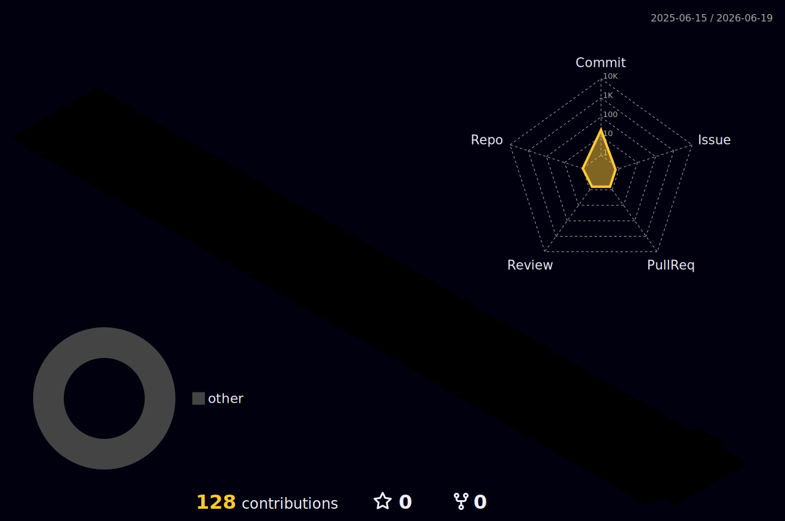

 

⸻

𓆩 Current Status 𓆪

Role:
  AI Engineer Intern @ ITOMATA
Previous:
  Flutter Developer Intern @ RABLO
Focus:
  - AI Systems
  - LLM Applications
  - Distributed Systems
  - Backend Infrastructure
  - Systems Engineering
Interests:
  - Multi-Agent Architectures
  - Event-Driven Systems
  - Context Engineering
  - Inference Infrastructure
Current Project:
  HELIOS

⸻

𓆩 Mission 𓆪

┌─────────────────────────────────────────────┐
│                                             │
│           AI × SYSTEMS × SCALE              │
│                                             │
│   Engineering intelligent systems and       │
│   infrastructure for real-world impact.     │
│                                             │
└─────────────────────────────────────────────┘

⸻

⸻

⚙️ TECH MATRIX

𓆩 Languages 𓆪

⸻

𓆩 Frontend 𓆪

⸻

𓆩 Backend 𓆪

⸻

𓆩 Databases 𓆪

⸻

𓆩 DevOps & Infrastructure 𓆪

⸻

𓆩 Cloud & Tools 𓆪

⸻

𓆩 AI / ML 𓆪

⸻

🧠 AI SYSTEMS STACK

<table>
<tr>
<td width="33%" align="center">

LLM Layer

LangChain

Gemini API

OpenAI SDK

Structured Outputs

Function Calling

Prompt Engineering

RAG Pipelines

MCP

</td>
<td width="33%" align="center">

Multi-Agent Layer

Supervisor Agents

Task Routing

Memory Systems

Tool Calling

Planning

Context Engineering

Agentic Workflows

Distributed Intelligence

</td>
<td width="33%" align="center">

Systems Layer

FastAPI

Spring Boot

PostgreSQL

Docker

REST APIs

Microservices

Event-Driven Systems

Backend Infrastructure

</td>
</tr>
</table>

⸻

🚀 ENGINEERING DOMAINS

 

⸻

𓆩 Current Focus Matrix 𓆪

┌──────────────────────────────────────┐
│                                      │
│             PROJECT HELIOS           │
│                                      │
├──────────────────────────────────────┤
│                                      │
│  ✓ AI Systems                        │
│  ✓ Multi-Agent Architectures         │
│  ✓ Context Engineering               │
│  ✓ Event-Driven Systems              │
│  ✓ Tool Calling                      │
│  ✓ Backend Infrastructure            │
│  ✓ Distributed Systems               │
│                                      │
└──────────────────────────────────────┘

⸻

⸻

🚀 PROJECT VAULT

☀️ HELIOS

Multi-Agent AI Platform

+ Multi-provider LLM Inference
+ Context Engineering
+ Tool Calling
+ Agentic Workflows
+ Event-Driven Systems
+ Backend Infrastructure
+ Distributed Intelligence

Repository:

https://github.com/SharveeshM1/HELIOS

⸻

💳 MIDAS

AI-Powered Fintech Platform

+ Spring Boot
+ PostgreSQL
+ Flutter
+ REST APIs
+ Authentication
+ Backend Services
+ Product Engineering

Repository:

https://github.com/SharveeshM1/Midas

⸻

🛒 whole_app

Cross-Platform Commerce Platform

+ Flutter
+ Firebase
+ Realtime Database
+ User Authentication
+ Mobile Architecture
+ Product Systems

Repository:

https://github.com/SharveeshM1/whole_app

⸻

📊 ENGINEERING ANALYTICS

 

⸻

📈 CONTRIBUTION MATRIX

⸻

🏆 ACHIEVEMENT WALL

⸻

🔥 SYSTEM STATUS

AI Systems:
  status: ACTIVE
LLM Applications:
  status: ACTIVE
Backend Infrastructure:
  status: ACTIVE
Distributed Systems:
  status: ACTIVE
Systems Engineering:
  status: ACTIVE
Current Mission:
  HELIOS
State:
  BUILDING

⸻

⸻

🐍 DYNAMIC SYSTEMS

⸻

🔥 Contribution Snake

⸻

👾 Pacman Contribution Graph

⸻

🌌 3D Contribution Terrain

⸻

📡 METRICS DASHBOARD

⸻

🧠 LEETCODE MATRIX

⸻

⚡ TERMINAL

> SYSTEM STATUS
NAME        : SHARVEESH M
ROLE        : AI SYSTEMS ENGINEER
CURRENT MISSION
---------------
HELIOS
DOMAINS
-------
AI SYSTEMS
LLM APPLICATIONS
BACKEND INFRASTRUCTURE
SYSTEMS ENGINEERING
STATE
-----
BUILDING

⸻

📈 LIVE ACTIVITY

HELIOS:
  status: ACTIVE
MIDAS:
  status: ACTIVE
whole_app:
  status: ACTIVE
AI Systems:
  mode: BUILDING
Infrastructure:
  mode: ACTIVE
Distributed Systems:
  mode: ACTIVE
Current Version:
  v∞

⸻

🌊 CYBERPUNK DIVIDER

⸻

🛸 MATRIX RAIN

01001000 01000101 01001100 01001001 01001111 01010011
AI SYSTEMS
MULTI AGENT ARCHITECTURES
EVENT DRIVEN SYSTEMS
01010011 01011001 01010011 01010100 01000101 01001101

⸻

⚙️ FUTURE MODULES

MODULE	STATUS
Neural Core	ACTIVE
Agent Layer	ACTIVE
Context Engine	ACTIVE
Orchestration Layer	ACTIVE
Distributed Intelligence	ACTIVE
HELIOS	BUILDING

⸻

