<!-- profile-render: 2026-06-17 -->


 

<a href="https://leetcode.com/u/Sharveesh_m/">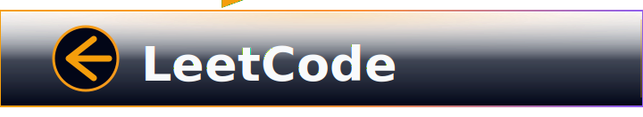</a>

<a href="https://github.com/SharveeshM1/HELIOS">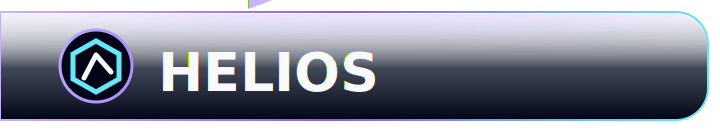</a>


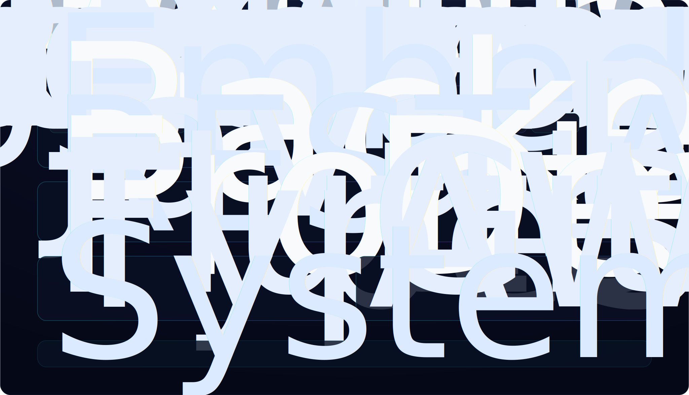

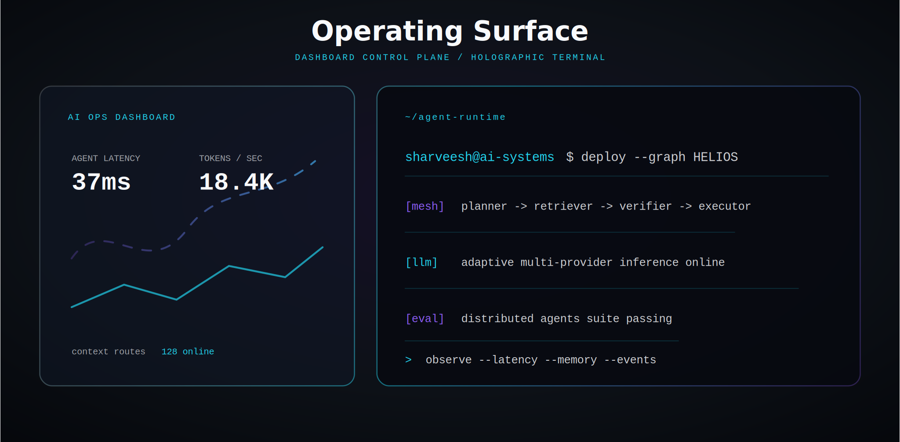

<a href="https://github.com/SharveeshM1/HELIOS">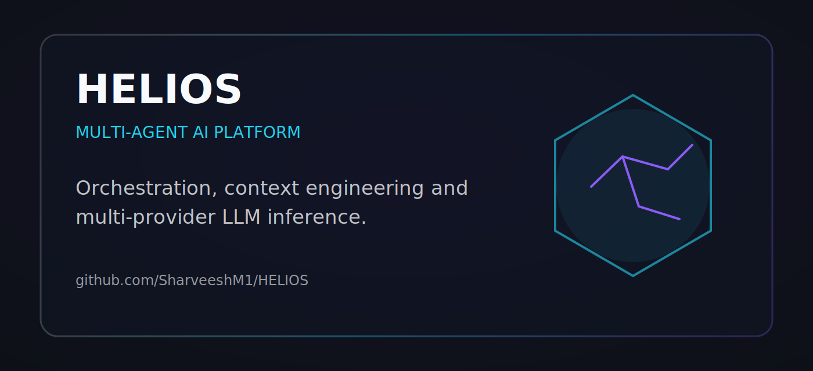</a>
<a href="https://github.com/SharveeshM1/Midas">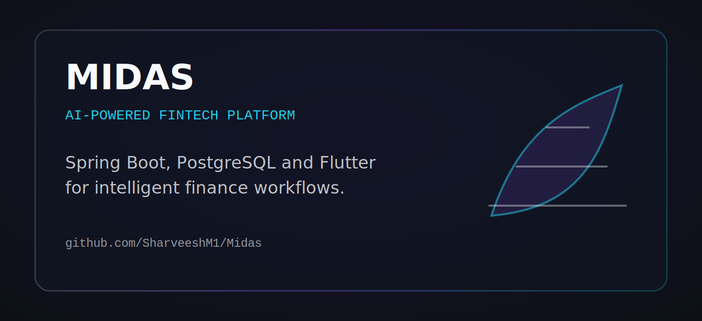</a>
<a href="https://github.com/SharveeshM1/whole_app">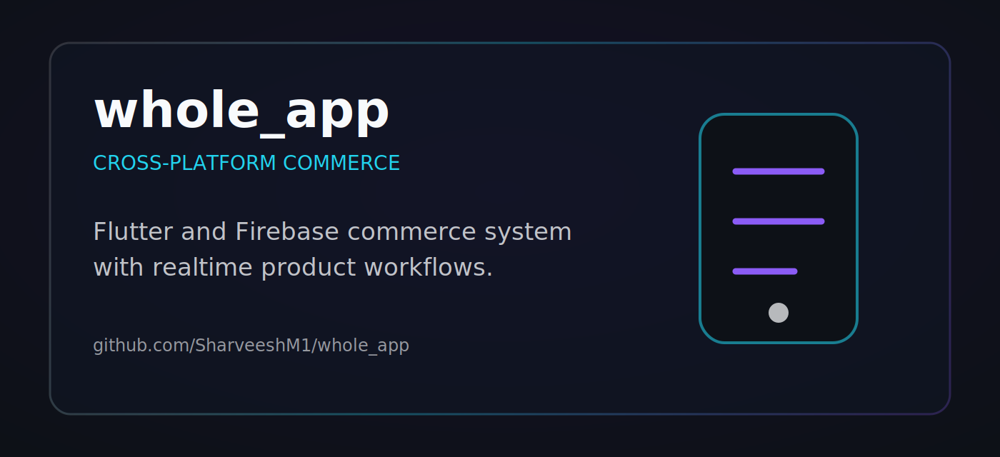</a>

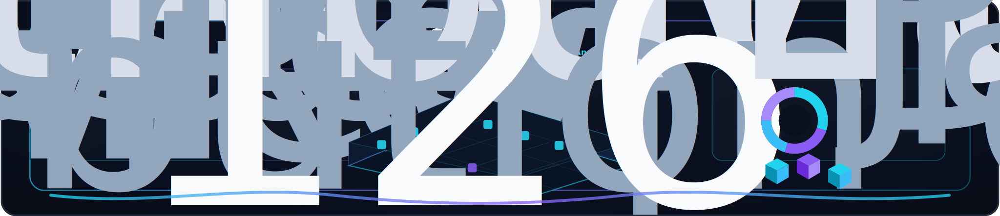

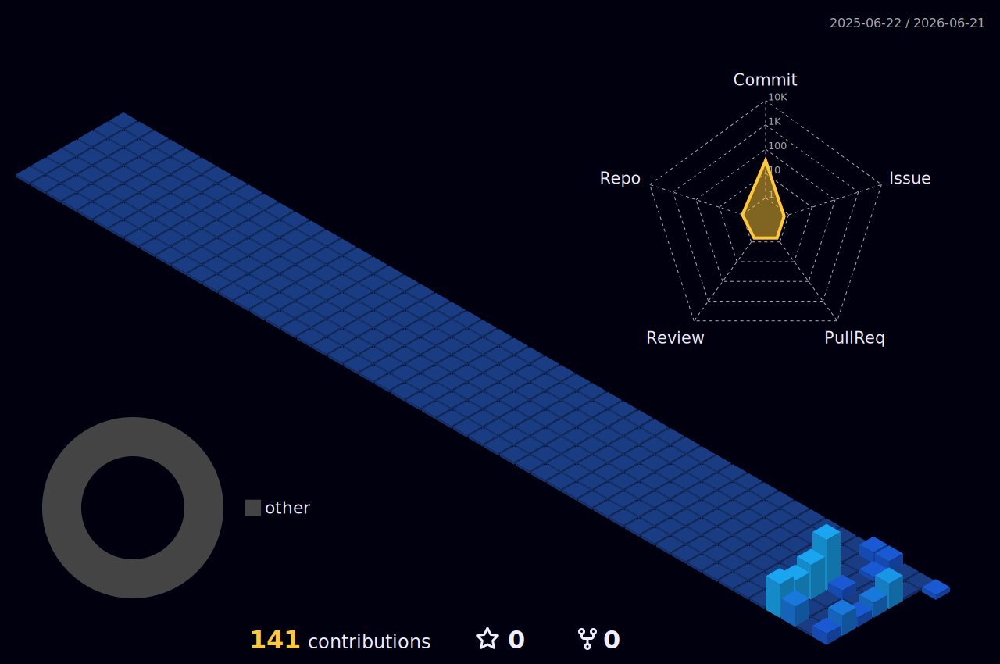



<code>Building intelligent systems.</code>

