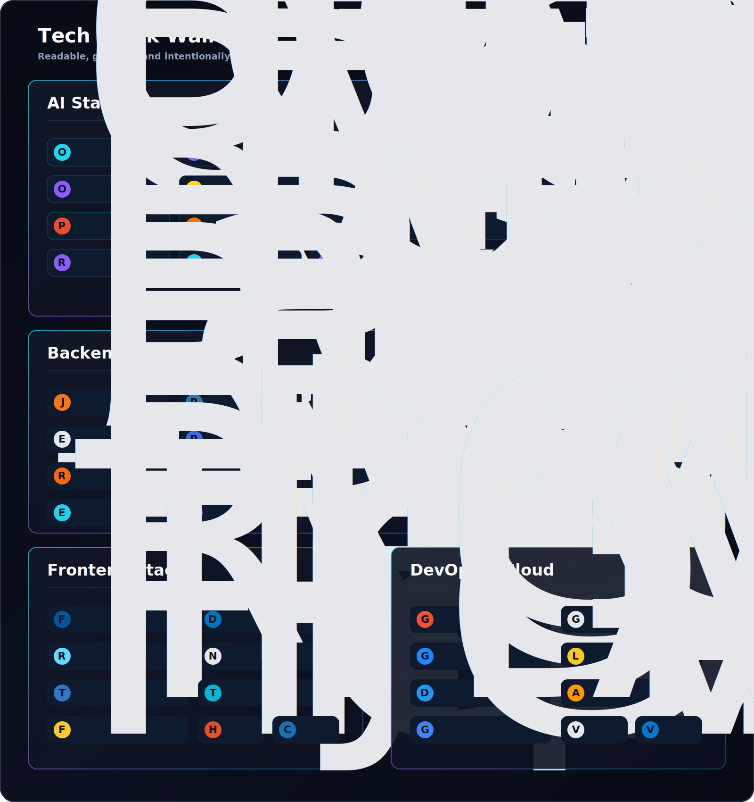
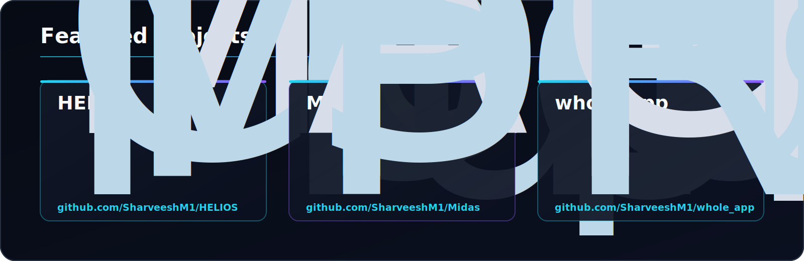
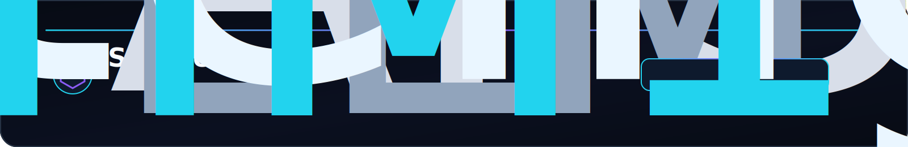

<h1>Sharveesh M</h1>
<h3>AI Systems Engineer</h3>

<strong>LLM Applications • Multi-Agent Infrastructure • Backend Systems</strong>

Current focus: <strong>HELIOS</strong>

 

<h2>AI Core Architecture</h2>

 

<h2>Tech Stack Wall</h2>

 

<h2>Featured Projects</h2>

 

<h2>GitHub Signal</h2>

 

