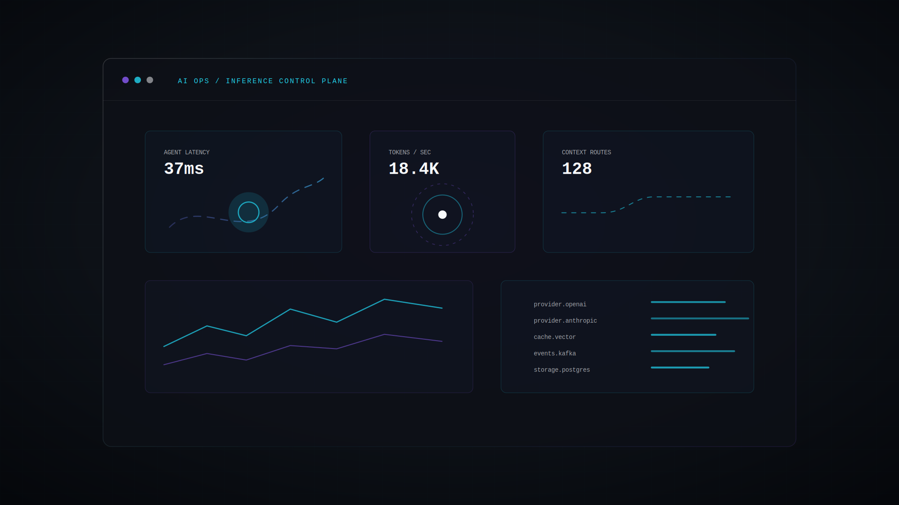
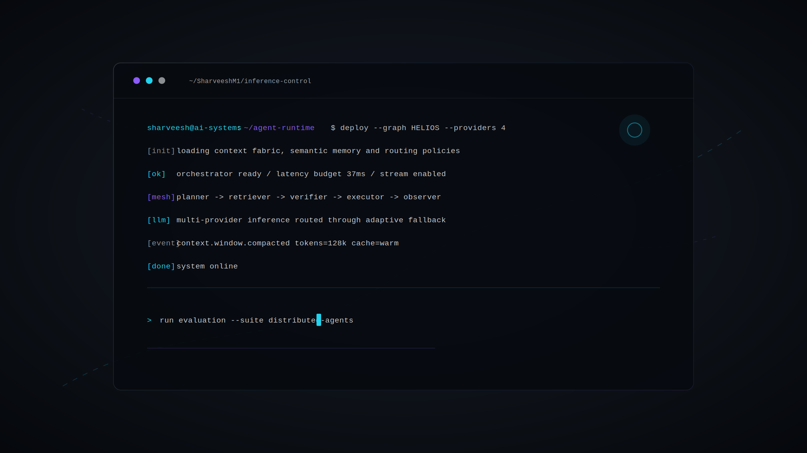

<div align="center">


<br />

<a href="https://www.linkedin.com/in/sharveesh-m-52516a283/">LinkedIn</a>
&nbsp;&nbsp;•&nbsp;&nbsp;
<a href="mailto:sharveesh1@gmail.com">Email</a>
&nbsp;&nbsp;•&nbsp;&nbsp;
<a href="https://leetcode.com/u/Sharveesh_m/">LeetCode</a>
&nbsp;&nbsp;•&nbsp;&nbsp;
<a href="https://github.com/SharveeshM1">GitHub</a>

</div>


## AI Systems Engineer

I build AI systems that care about the full stack: orchestration, context, inference, backend infrastructure, product surfaces, and the reliability layer underneath.

```yaml
current_role: AI Engineer Intern @ ITOMATA
previous_role: Flutter Developer Intern @ RABLO
core_domains:
  - AI Systems
  - LLM Applications
  - Distributed Systems
  - Backend Infrastructure
  - Systems Engineering
  - Multi-Agent Architectures
  - Event-Driven Systems
  - Context Engineering
  - Inference Infrastructure
```

<div align="center">
  
</div>


## Operating Surface

<table>
  <tr>
    <td width="50%">
      
    </td>
    <td width="50%">
      
    </td>
  </tr>
</table>

## Featured Systems

<a href="https://github.com/SharveeshM1/HELIOS">
  
</a>

<br />

<a href="https://github.com/SharveeshM1/Midas">
  
</a>

<br />

<a href="https://github.com/SharveeshM1/whole_app">
  
</a>


## Engineering Map

<table>
  <tr>
    <td width="33%"><strong>HELIOS</strong><br />Multi-agent AI platform with orchestration, context engineering and multi-provider LLM inference.</td>
    <td width="33%"><strong>MIDAS</strong><br />AI-powered fintech platform using Spring Boot, PostgreSQL and Flutter.</td>
    <td width="33%"><strong>whole_app</strong><br />Cross-platform commerce platform built with Flutter and Firebase.</td>
  </tr>
</table>

<div align="center">
  
</div>

## GitHub Signal

<div align="center">


<br />


</div>

<div align="center">


<picture>
  <source media="(prefers-color-scheme: dark)" srcset="output/pacman-contribution-graph-dark.svg" />
  
</picture>


</div>


## System Status

```text
AI Systems              ACTIVE
LLM Applications        ACTIVE
Distributed Systems     ACTIVE
Backend Infrastructure  ACTIVE
Multi-Agent Runtime     BUILDING
Context Engineering     ACTIVE
Inference Systems       ACTIVE
```

<div align="center">
  
</div>
